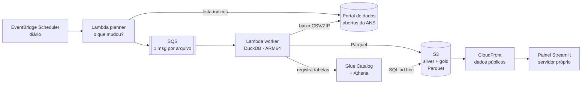

# ANS BI Operadoras

BI público e open source das **operadoras de planos de saúde do Brasil**, construído sobre os
[dados abertos da ANS](https://dadosabertos.ans.gov.br/FTP/PDA/): beneficiários, reclamações (NIP),
IGR e IDSS, com filtros por UF, cobertura, período e operadora.

O objetivo é o **menor custo operacional possível** sem abrir mão de desempenho:

- não há servidor ligado nem banco de dados;
- o pipeline roda sob demanda em AWS Lambda e grava Parquet no S3;
- o painel é um app **Streamlit** com busca de operadoras, rankings prontos ("quem tem mais
  reclamações?") e fichas detalhadas, e roda num container em qualquer servidor.

No uso típico, tudo cabe na camada gratuita da AWS (veja [custos](docs/arquitetura.md#custos)).
O projeto também roda **100% local, sem conta na AWS**.



## Como funciona

1. **Planner** (diário): lê os índices do portal da ANS e compara a data e o tamanho de cada
   arquivo com marcadores gravados no S3. Só o que mudou vai para a fila. Nada é baixado nessa etapa.
2. **Worker** (um arquivo por invocação, até 3 em paralelo): baixa o arquivo, converte o CSV
   com DuckDB e grava uma partição Parquet (zstd) na **silver**. Arquivos grandes são agregados
   já na entrada: o ICB de SP (~2,5 GB de CSV) vira ~700 KB, usando ~430 MB de RAM em ~20 s.
3. **Gold**: quando a fila esvazia, o worker monta os marts (`src/ans_bi/sql/gold/*.sql`) e
   publica os Parquet com nome imutável (cache de 1 ano no CloudFront) e um `manifest.json`
   com cache curto. No mesmo passo, registra as tabelas no Glue para consultas SQL no Athena.
4. **Painel**: o Streamlit carrega os marts (~6 MB) num DuckDB em memória. Cada filtro responde
   em milissegundos. O painel lê a gold local ou a URL pública do CloudFront (`ANS_GOLD_URI`).

## O painel

A tela inicial é um **mapa do Brasil**. Ao clicar em um estado, ele cresce e fica destacado, e um
painel lateral lista as operadoras **com sede** ali, com o total de clientes de cada uma no Brasil.
Dá para filtrar pela cidade da sede e buscar pelo nome. O estado escolhido fica na URL
(ex.: `/?uf=RS`), então o link pode ser compartilhado.

Clicar numa operadora abre a **ficha**, escrita para quem não é da área, em três abas:
- **Resumo**: clientes, sede, "Qualidade (IDSS)" e "Reclamações (IGR)" com leitura em palavras
  ("Muito boa", "Poucas reclamações") e semáforo 🟢🟡🔴, reclamações resolvidas e assuntos mais reclamados;
- **Histórico**: clientes e reclamações por trimestre, nota de qualidade por ano;
- **Contato**: telefone, e-mail, endereço e dados cadastrais (CNPJ, registro, ano de entrada na ANS).

O mapa é um componente próprio (`app/componentes/`): SVG com animação em CSS, desenhado a partir da
malha oficial de estados do IBGE (`app/assets/br_uf.json`), sem bibliotecas externas.

## Fontes

| Fonte | Pasta na ANS | Granularidade | Camada silver |
|---|---|---|---|
| Cadastro de operadoras (ativas e canceladas) | `operadoras_de_plano_de_saude_*` | snapshot diário | `silver/operadoras/situacao=/snapshot=` |
| Beneficiários consolidados (ICB) | `informacoes_consolidadas_de_beneficiarios-024` | mensal × UF | `silver/beneficiarios_{municipio,perfil}/competencia=/uf=` |
| Reclamações (NIP) | `demandas_dos_consumidores_nip` | anual | `silver/nip/ano=` |
| IGR | `IGR/IGR_versao_2023` | mensal | `silver/igr/` |
| IDSS | `historico_idss-020` | anual | `silver/idss/` |
| TISS hospitalar (consolidado) | `TISS/HOSPITALAR` | mensal × UF | `silver/tiss_hospitalar/competencia=/uf=` |

Detalhes, decisões e limitações dos dados: [docs/dados.md](docs/dados.md).

## Rodando localmente (sem AWS)

Requisitos: [uv](https://docs.astral.sh/uv/) e Python 3.12+.

```bash
make setup                      # dependências
ANS_UFS=SP,RJ make run          # processa os últimos meses de SP e RJ (+ bases nacionais)
make app                        # painel em http://localhost:8501
```

`make run` sem `ANS_UFS` processa todas as UFs. `make backfill` processa todo o histórico
desde `ANS_START_YEAR` (padrão 2021; ~10 GB de download, de 20 a 30 min numa conexão boa).
Os dados ficam em `data/lake/`. Para outras opções, rode `uv run ans-bi --help` e veja o [.env.example](.env.example).

### Consultar com SQL (SQLTools, DBeaver, CLI do DuckDB)

`make banco` gera `data/ans_bi.duckdb`: um arquivo pequeno, só com views sobre o lake, organizadas nos
esquemas `gold` (tabelas prontas para análise) e `silver` (dados tratados linha a linha), com descrição
de tabelas e colunas. Rode de novo depois de cada atualização dos dados.

No VS Code, instale o SQLTools e o driver `Evidence.sqltools-duckdb-driver` e crie uma conexão DuckDB
apontando para `data/ans_bi.duckdb` em modo *Read Only* (feche a conexão antes de rodar `make banco`).
Consultas de exemplo em [sql/exemplos/consultas.sql](sql/exemplos/consultas.sql).

A pasta `.vscode/` não vai para o git (o caminho do banco é absoluto). Para configurar, crie
`.vscode/settings.json` com o caminho da sua cópia do projeto:

```json
{
  "sqltools.connections": [
    {
      "name": "ANS BI (DuckDB)",
      "driver": "DuckDB",
      "databaseFilePath": "/caminho/para/ans-bi-operadoras/data/ans_bi.duckdb",
      "accessMode": "Read Only",
      "previewLimit": 100
    }
  ],
  "sqltools.useNodeRuntime": true
}
```

## Servidor próprio (Docker)

```bash
docker compose up -d --build    # painel em :8501 + pipeline diário, dados em ./data
```

## Deploy na sua conta AWS

Requisitos: AWS CLI configurado com um usuário IAM (**não use a conta root**), Node.js 20+ e uv.
Passo a passo e política IAM mínima: [docs/deploy.md](docs/deploy.md).

```bash
cp .env.example .env            # ajuste AWS_PROFILE / região / ALERT_EMAIL
make bootstrap                  # uma vez por conta+região
make deploy                     # cria tudo (~5 min)
make seed                       # opcional: envia o histórico já processado localmente
make invoke-backfill            # ...ou processa o histórico direto na nuvem
make outputs                    # URL pública dos dados (use em ANS_GOLD_URI no painel)
```

A partir daí, o agendamento diário mantém tudo atualizado. Consultas SQL ficam disponíveis no
Athena (workgroup `ans-bi`, database `ans_bi`), com limite de 1 GB escaneado por consulta.

## Estrutura

```
src/ans_bi/          pipeline (Python + DuckDB)
  sources.py         catálogo de fontes: descoberta e partições
  pipeline.py        planner/worker
  gold.py            marts + manifest do site
  banco.py           banco DuckDB de views para consulta (make banco)
  catalog.py         registro no Glue (partition projection, sem crawler)
  handlers.py        entradas das Lambdas
  sql/silver, sql/gold
app/                 painel Streamlit
  streamlit_app.py   mapa + lista de operadoras
  ficha_operadora.py ficha em abas
  componentes/       mapa do Brasil em SVG (componente próprio)
sql/exemplos/        consultas SQL de exemplo
infra/               AWS CDK (Python)
scripts/             empacotamento da Lambda
tests/               testes sem rede, com fixtures sintéticas
```

## Desenvolvimento

```bash
make test lint       # testes e estilo
make synth           # valida a infraestrutura sem publicar
```

Contribuições são bem-vindas. Uma nova fonte precisa de:
- uma entrada em `sources.py`;
- um SQL em `sql/silver`;
- se aparecer no painel, um mart em `sql/gold`.

## Licença

[MIT](LICENSE). Os dados são da ANS e seguem os termos do Portal Brasileiro de Dados Abertos.
Este projeto não tem vínculo com a ANS.
